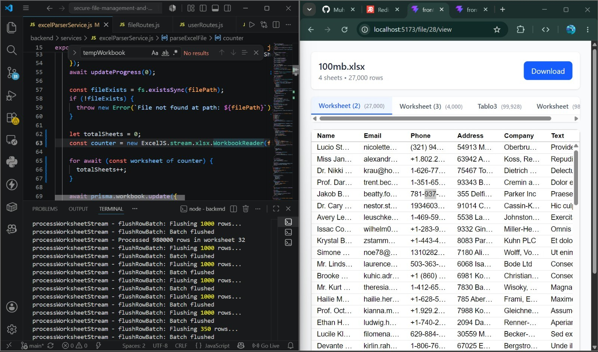
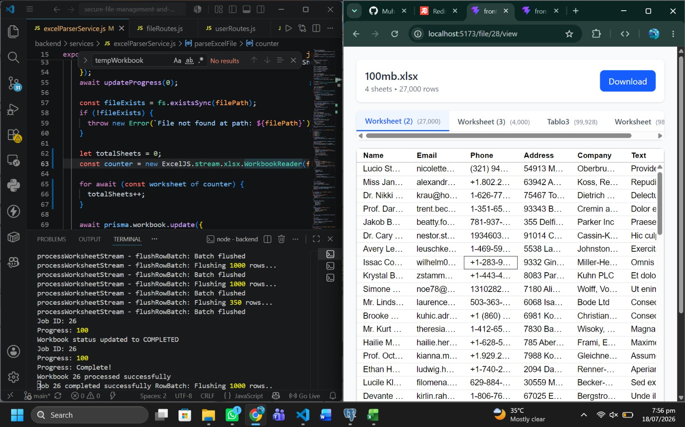

# Secure File Management & Sharing System

A secure, enterprise-ready REST API for document management, file sharing, and large-scale Excel processing, built with **Node.js**, **Express.js**, **PostgreSQL**, **Prisma ORM**, **BullMQ**, and **Redis**. The system combines **JWT authentication**, **dynamic Role-Based Access Control (RBAC)**, **List-Based Access Control (LBAC)**, **background job processing**, **streaming Excel imports**, **secure file sharing**, and **automated file lifecycle management** to provide a scalable and production-ready document management platform.

---

## High-Performance Excel Processing

The system is optimized to process **large Excel workbooks containing over 1 million records** using a streaming architecture powered by **ExcelJS**, **BullMQ**, and **Redis**. By processing data in batches instead of loading entire workbooks into memory, the application achieves high throughput while maintaining low memory consumption.

### Processing Demo

> Example showing the background worker successfully processing an Excel workbook containing **1,000,000+ records** using streaming and batch database operations.

# Features

## Authentication & Authorization

- JWT Authentication using Access & Refresh Tokens
- Secure password hashing with bcrypt
- Protected REST APIs
- Middleware-based authentication
- Dynamic Role-Based Access Control (RBAC)
- List-Based Access Control (LBAC) for secure file sharing
- Permission-based authorization for every protected endpoint

---

## Dynamic User, Role & Permission Management

The authorization system is fully configurable without changing application code.

Administrators can:

- Create, update, and delete roles
- Create and manage permissions
- Assign permissions to roles
- Assign multiple roles to users
- Revoke permissions dynamically

Users automatically inherit permissions through their assigned roles, enabling organizations to modify authorization policies without redeploying the application.

---

## File Management

The system supports secure document management with fine-grained access control.

### Features

- Secure file uploads
- File downloads
- File updates
- Soft delete & restore
- Permanent deletion
- Dynamic file categories
- Dynamic document types
- File metadata storage
- Owner tracking
- MIME type validation
- Secure storage using virtual path mapping

Only authorized users can access files, while administrators have unrestricted access.

---

## Secure File Sharing

Files can be securely shared through generated links.

### Features

- UUID-based share tokens
- Configurable expiration time
- Read-only and read/write permissions
- Link revocation
- Token validation
- Secure authorization before every sharing operation

---

## Soft Delete & File Lifecycle Management

Instead of immediately deleting files, the application provides a recovery mechanism.

### Features

- Soft delete
- File restoration
- 30-day recovery period
- Automatic hard deletion
- Scheduled cleanup using Node-Cron

This protects against accidental data loss while ensuring efficient storage management.

---

## Excel Processing Pipeline

A production-ready asynchronous Excel processing system capable of handling very large workbooks efficiently.

### Features

- Background processing using BullMQ
- Redis-backed job queues
- Streaming Excel parsing with ExcelJS
- Memory-efficient processing
- Batch database insertion
- Progress tracking
- Workbook status management
- Worksheet, row, and cell extraction
- Error handling for corrupted or invalid files
- Dead Letter Queue (DLQ) support for failed jobs

Processing occurs asynchronously, allowing uploads to return immediately while work continues in the background.

---

## Large File Optimization

The application is optimized for processing large Excel files without exhausting server memory.

### Implemented Optimizations

- Streaming workbook reading
- Chunk-based processing
- Batch inserts into PostgreSQL
- Reduced memory consumption
- Efficient database writes

The processing pipeline has been successfully tested with Excel workbooks containing **1,000,000+ records**.

---

## Background Job Processing

Long-running operations are handled asynchronously using BullMQ and Redis.

### Background Jobs

- Excel processing
- Progress updates
- Failure handling
- Email notifications
- Dead Letter Queue (DLQ)

This keeps the API responsive while processing resource-intensive tasks.

---

## Workbook Processing Tracking

Every uploaded workbook maintains its processing state.

### Supported Statuses

- Pending
- Processing
- Completed
- Failed

### Tracking Information

- Progress percentage
- Total worksheets
- Processed worksheets
- Error messages
- Processing timestamps

---

## Failure Handling

The system gracefully handles processing failures.

### Examples

- Invalid Excel files
- Corrupted workbooks
- Duplicate worksheet detection
- Database insertion failures
- Queue failures

Failed jobs can be inspected and retried through the Dead Letter Queue.

---

## Resumable Uploads

The upload pipeline supports resumable uploads for large files.

### Features

- Chunk-based uploads
- Resume interrupted uploads
- Temporary chunk storage
- Server-side chunk merging
- Improved reliability over unstable networks

---

## Efficient File Downloads

Large files are served efficiently using HTTP Range Requests.

### Features

- Chunked downloads
- Resume interrupted downloads
- Partial content support
- Reduced memory usage

---

## Email Notifications

Automatic email notifications inform users about processing events.

### Notifications

- Processing completed
- Processing failed
- Error details for failed uploads

---

## Dynamic System Configuration

The system avoids hardcoded configurations by allowing administrators to manage:

- Roles
- Permissions
- Categories
- Document Types

This makes the application highly adaptable to evolving business requirements.

---

## Security

Security is enforced throughout the application.

### Features

- JWT Authentication
- Role-Based Access Control (RBAC)
- List-Based Access Control (LBAC)
- Middleware-based authorization
- Permission validation
- Hidden physical storage paths
- Owner-based file access
- Secure sharing tokens
- Soft delete protection

---

# Technologies Used

## Backend

- Node.js
- Express.js
- PostgreSQL
- Prisma ORM

## Authentication

- JWT
- bcrypt

## Background Processing

- BullMQ
- Redis

## File Processing

- ExcelJS (Streaming API)
- Multer

## Scheduling

- Node-Cron

## Development Tools

- Postman

---

# Core Concepts Demonstrated

- JWT Authentication
- Refresh Token Authentication
- Role-Based Access Control (RBAC)
- List-Based Access Control (LBAC)
- Dynamic Permission Management
- Middleware-Based Authorization
- RESTful API Design
- Prisma ORM
- PostgreSQL Relational Modeling
- Background Job Processing
- Redis Queues
- BullMQ Workers
- Dead Letter Queues (DLQ)
- Streaming File Processing
- Batch Database Operations
- Large File Optimization
- HTTP Range Requests
- Resumable File Uploads
- Secure File Sharing
- Soft Delete
- Hard Delete
- Scheduled Background Jobs
- Virtual File Path Mapping

---

# Project Highlights

This project demonstrates the design of a production-ready enterprise document management platform capable of secure file storage, dynamic authorization, and high-performance processing of large Excel workbooks.

### Key Highlights

- Dynamic RBAC and LBAC authorization
- Enterprise-grade permission management
- Secure document sharing
- Asynchronous background processing with BullMQ and Redis
- Memory-efficient streaming Excel processing
- Support for **100,000+ record Excel files**
- Dead Letter Queue (DLQ) for reliable failure handling
- Resumable uploads and HTTP Range-based downloads
- Automated file lifecycle management with scheduled cleanup
- Modular, scalable REST API architecture
- Analytics-ready processing metadata for dashboard visualization